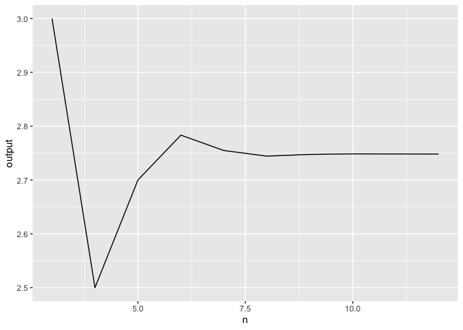

<!-- README.md is generated from README.Rmd. Please edit that file -->

# hw04peqdietze

<!-- badges: start -->
<!-- badges: end -->

The goal of hw04peqdietze is to …

## Installation

You can install the released version of hw04peqdietze by asking me for a
copy!

``` r
install.packages("hw04peqdietze")
```

## Example

This is a basic example which shows you how to solve a common problem:

``` r
library(hw04peqdietze)
## basic example code of myseq_n

myseq_n(x = c(2, 3, 3), n = 3)
#> [1] 3

## basic example code of myplot_n

my_data <- tibble::tribble(
  ~x, ~y, ~z, ~n,
  2,4,3,3,
  2,4,3,4,
  2,4,3,5,
  2,4,3,6,
  2,4,3,7,
  2,4,3,8,
  2,4,3,9,
  2,4,3,10,
  2,4,3,12)

myplot_n(my_data)
#> Warning: Unknown or uninitialised column: `output`.
```


